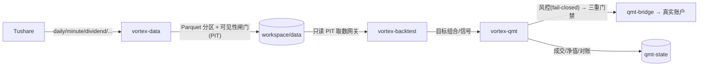
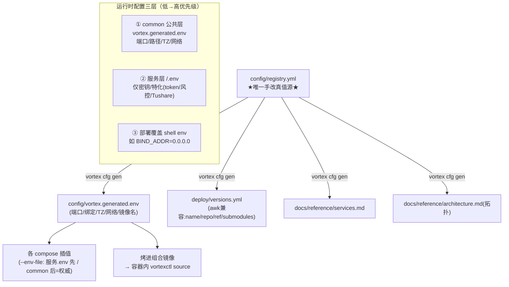
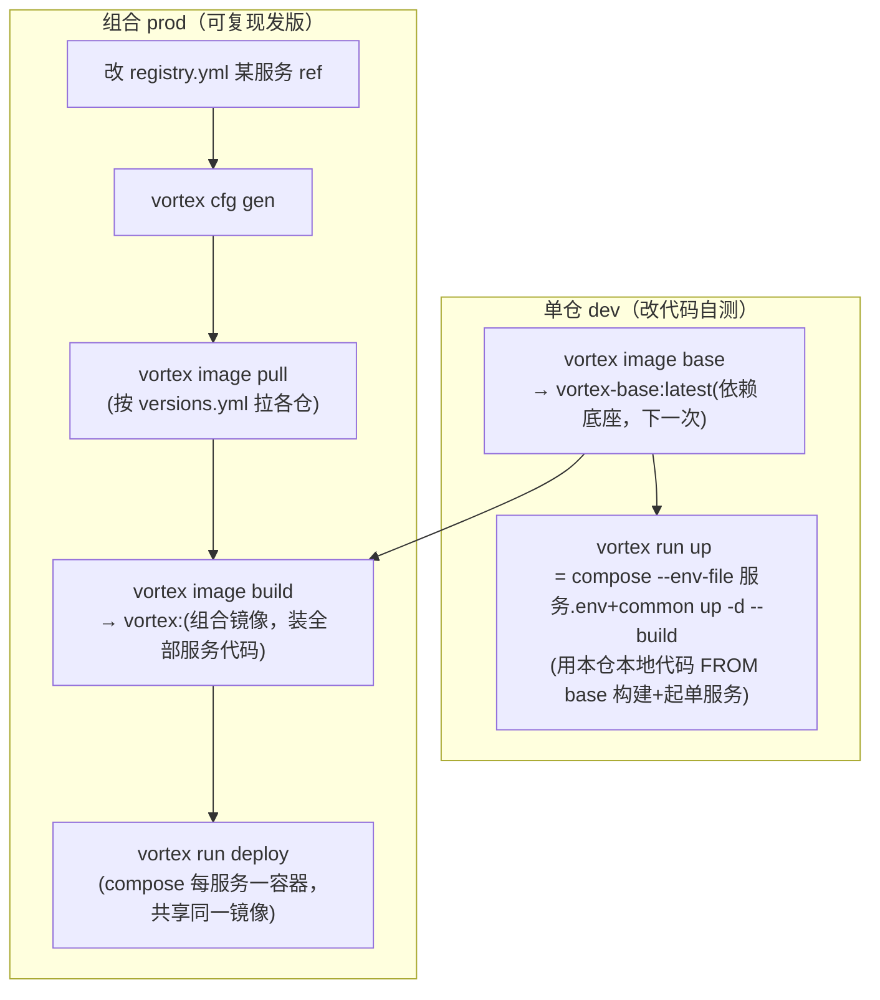

# Vortex 系统架构总览

> 系统级文档（system 层）。各服务自身文档在各仓 `README.md` / `CLAUDE.md` / `design/`。
> 配置/端口的**唯一真值源**是 [`config/registry.yml`](../../config/registry.yml)；本文图示与之一致。
> 系统拓扑的**生成版**见 [`docs/reference/architecture.md`](../reference/architecture.md)（由 `vortex cfg gen` 随 registry 自动刷新）；本文是手写的概念视图（数据流 / 配置分层 / 构建发布）。

## 1. 服务与端口

Vortex 是多仓库量化系统：一个公共底座 + 多个独立服务。端口"一号到底、内外一致"（容器内监听端口 == 对外映射端口），由 `config/registry.yml` 钉死、`vortex.generated.env` 注入（详见 [ADR-003](../adr/ADR-003-unified-config-architecture.md)）。

| 服务 | 仓库 | 端口（内外一致） | 角色 |
|------|------|------|------|
| vortex-data | vortex_data | **8765** | 数据底座：Tushare 采集 → Parquet → DuckDB → 看板/API |
| vortex-backtest | vortex_backtest | **8766** | 回测引擎：只读消费 workspace，A股分钟级撮合、会话式引擎 |
| vortex-qmt | vortex_qmt | **8767** | 实盘交易：目标组合→风控→QMT 桥接(Windows)→对账 |
| vortex-trader | vortex_trader | **8768**（预留） | 投资 agent：自主研究/交易（规划中） |
| vortex_common | — | — | 公共底座：`vortex-base` 镜像、`registry.yml` 真值源、`vortex` CLI、部署编排 |

## 2. 系统拓扑

```mermaid
graph TB
  subgraph host["宿主机 · vortex-net（默认绑 127.0.0.1，对外需显式 BIND_ADDR=0.0.0.0）"]
    data["vortex-data :8765<br/>数据底座"]
    bt["vortex-backtest :8766<br/>回测"]
    qmt["vortex-qmt :8767<br/>实盘"]
    tr["vortex-trader :8768<br/>预留"]
    ws[("workspace<br/>/workspace")]
    bs[("backtest-state")]
    qs[("qmt-state")]
  end
  win["Windows 主机<br/>qmt-bridge :8000<br/>(miniQMT)"]
  tus["Tushare API"]

  tus -- 采集 --> data
  data -- 写 --> ws
  bt -- 只读消费 --> ws
  bt --> bs
  qmt --> qs
  qmt -- QMTClient(HTTP) --> win
  tr -. 规划:研究/下单 .-> data
  tr -. .-> bt
  tr -. .-> qmt
```

## 3. 数据流



要点：data 是唯一**写** workspace 的服务；backtest 只读消费（避免未来函数，走 PIT 可见性闸门）；qmt 实盘默认 `enable_trading=false`（kill-switch），每笔还需账户白名单 + 确认。

## 4. 配置架构（单一真值源 + 三层合并）



防漂移：`vortex cfg check` 校验端口唯一/升序、生成物最新、`.env` 无禁用键（端口/路径/TZ 不得出现在服务 `.env`）。容器内监听恒 `0.0.0.0`（不变量，≠对外暴露）；宿主机 workspace/state 根机器相关，由 `vortex run` 运行时解析为绝对路径（默认 `~/vortex/{workspace,state}`），不烤进 committed env。

## 5. 构建与发布流程



两形态都"单服务可独立"：dev 起单仓；prod 每服务独立容器（可单独 `docker compose up -d vortex-data` 重启）。详见 [ADR-001](../adr/ADR-001-deployment-architecture.md)。

## 6. 命令速查

| 干什么 | 命令 |
|--------|------|
| 改公共配置 | 编辑 `config/registry.yml` → `vortex cfg gen` → `vortex cfg check` |
| 看端口/服务 | `vortex cfg ports` / `vortex cfg list` |
| 造依赖底座 | `vortex image base` |
| 单仓起服务(dev) | `vortex run up <data\|backtest\|qmt>`（停 `vortex run down <svc>`） |
| 发版(prod) | `vortex image pull && vortex image build --tag=<tag>` → `vortex run deploy` |

> `vortex`（宿主机编排）≠ `vortexctl`（容器内 PID1 启动器，compose 的 `command:`）。

## 相关文档
- [ADR-001 部署架构](../adr/ADR-001-deployment-architecture.md) · [ADR-002 workspace/state 变量](../adr/ADR-002-unified-workspace-env-vars.md) · [ADR-003 统一配置架构](../adr/ADR-003-unified-config-architecture.md)
- [部署与运行手册](../../deploy/CONFIG-AND-RUN.zh.md) · [服务总表(生成)](../reference/services.md) · [系统拓扑(生成)](../reference/architecture.md)
- 各服务仓：`vortex_data/` · `vortex_backtest/` · `vortex_qmt/` · `vortex_trader/`（各仓 `README.md` + `CLAUDE.md`）
