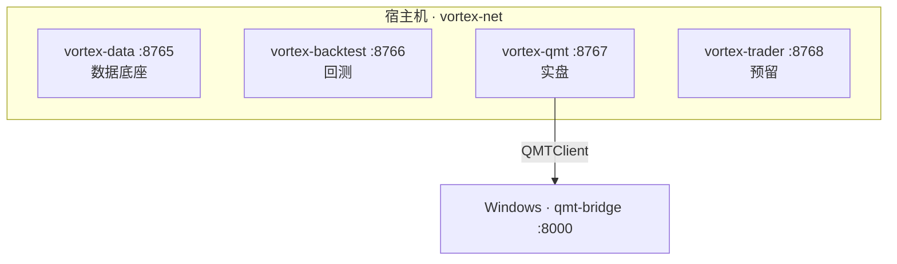

# 系统拓扑（生成）

# DO NOT EDIT — generated by `vortex cfg gen` from config/registry.yml

```mermaid
graph TB
  subgraph host["宿主机 · vortex-net"]
    data["vortex-data :8765<br/>数据底座"]
    backtest["vortex-backtest :8766<br/>回测"]
    qmt["vortex-qmt :8767<br/>实盘"]
    trader["vortex-trader :8768<br/>预留"]
  end
  qmt -- QMTClient --> win["Windows · qmt-bridge :8000"]
```
