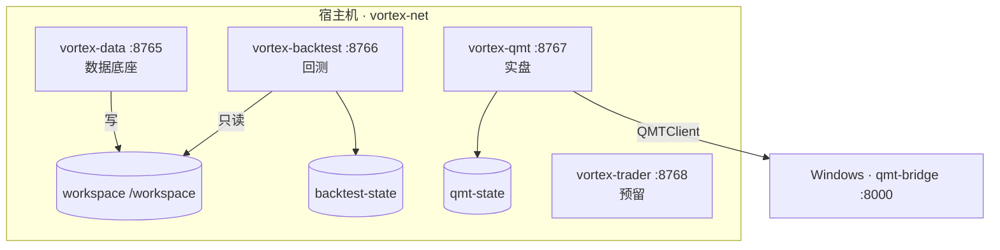
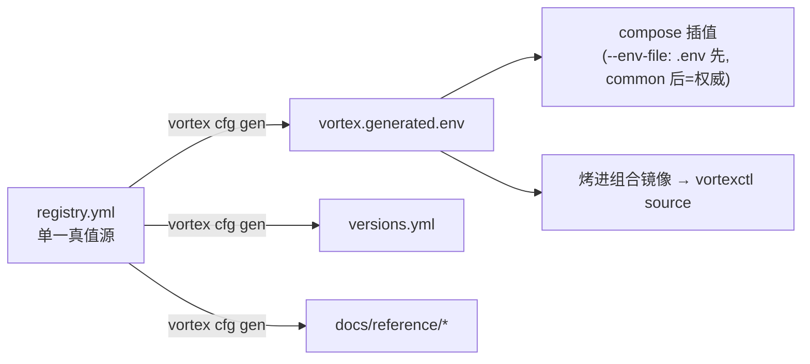

# Vortex 统一配置架构与文档体系整改 — 设计 (Spec)

**日期：** 2026-06-09
**作者：** @zyukyunman（owner）+ Claude
**状态：** Draft（待 owner review → 转 writing-plans 出实施计划）
**相关：** [ADR-001 部署架构](../../adr/ADR-001-deployment-architecture.md)、[ADR-002 统一 workspace/state 变量](../../adr/ADR-002-unified-workspace-env-vars.md)、本次将新增 **ADR-003 统一配置架构**

> 本 spec 已经过一轮对抗式审查（准确性/一致性/完整性/可行性四视角，对照真实仓库逐条核实），
> 下列结论均为 2026-06-09 实测：四仓 + trader 预留仓共 5 个 git 仓。

---

## 1. 背景与目标

Vortex 由五个 git 仓库组成：`vortex_common`（基础设施/部署底座）、`vortex_data`（数据底座）、
`vortex_qmt`（实盘交易）、`vortex_backtest`（回测）、`vortex_trader`（预留，**非空**——已有 README/
design/diagrams/ADR）。ADR-001 已确立"一个组合镜像 `vortex:<tag>` + 一进程一容器"，ADR-002 已把**代码层**
的 workspace/state 变量统一为 `VORTEX_WORKSPACE` / `VORTEX_STATE`。

**但配置这一层没有单一真值源，已经发生漂移**（实测）：

| 类别 | 现状问题（点名） |
|------|---------|
| 端口散落 | 端口号分散在每个 `.env`、`.env.example`、各仓 compose、`deploy/docker-compose.yml`、`vortexctl`、各仓 Dockerfile、in-app 文档站、大量文档中；`data/.env` 已漂成 `8888`。当前规范端口：**data 8765 / backtest 8767 / qmt 8810 / trader 8820（预留）**，不连续 |
| 端口"多套真相" | trader 文档把 data 标成 **8876**（PUBLIC_PORT 重映射示例）、backtest 标成 **8765**，与上面又不一致——同一系统在不同文档里三套端口 |
| 路径散落 | 宿主机 workspace 挂载路径在各 `.env` / `.env.example` 各写一份（`VORTEX_WORKSPACE_MOUNT` / `VORTEX_STATE_MOUNT`）；`data/.env` 写死 `/Users/zyukyunman/...` 绝对路径 |
| 死配置 / 旧名 | `backtest/.env`（真名）仍写 `VORTEX_BACKTEST_WORKSPACE` / `VORTEX_BACKTEST_STATE`，但代码早已不读（读标准名）；`backtest/deploy/run.sh` 导出旧名 `VORTEX_DATA_WORKSPACE` / `VORTEX_BACKTEST_STATE_DIR`（仅靠 ADR-002 fallback 才生效）；`qmt/.env` 用旧 `VORTEX_QMT_STATE_DIR` |
| `.env / .env.example` 互相漂移 | `backtest/.env.example` 已迁到 `_MOUNT` 名，而真 `.env` 还是旧 `*_WORKSPACE/*_STATE` 名 |
| 文档过时 | backtest `web/guide.html`（站内文档站，23 处端口/旧变量）、`data/service/docs_page.py`（PUBLIC_PORT 行 + compose 映射说明）、common port 表、trader 全套文档 + 两张系统拓扑 mermaid —— 端口/变量名全过时；无跨仓顶层索引 |
| `*_PUBLIC_PORT` | 容器内端口与对外端口可被映射成不同号，造成"内外不一致"的混乱 |
| 头注释误导 | `data/.env` / `qmt/.env` 文件头写"随仓提交"，但 `.env` 实际被 `.gitignore` 忽略（已核实未入库）——头注释与实际相反 |

> **关键修正（审计结论）**：ADR-002 承诺的**运行时代码迁移已经落地**——`data/cli.py:45`、
> `backtest/data_adapter.py:14`、`replay_engine.py:37`、`app.py:27/110`、`qmt/config.py:77`、
> `storage_reconcile.py:477` 均已改读标准变量（带 legacy fallback）。那个写死的 mac 路径**已从运行时
> 代码移除**。本次整改重心是**配置文件、launcher/Dockerfile、in-app 文档站、各仓文档**，而非运行时业务代码。

### 1.1 目标（owner 已拍板的四个决策）

1. **端口"一号到底"**：每个服务在 common 钉死唯一端口号，容器内监听它、对外也映射同一个号
   （内外一致由构造保证）；删除 `*_PUBLIC_PORT` 重映射旋钮；保留 `*_BIND_ADDR`（默认 `127.0.0.1`
   只绑回环，要对外才设 `0.0.0.0`）——安全暴露能力不丢。
2. **common 公共层**统一管理：端口注册表、宿主机 workspace/state 根路径（约定/默认）、公共运行参数
   （TZ / 默认绑定地址 / docker 网络名 / 镜像名）、服务注册元数据（投影出 `versions.yml`）、
   健康检查与重启策略约定。"通用配置都在 common，平时不改，除非加服务/加功能"。
3. **机制 = 结构化注册表 + 轻量生成器**：一个手改的 `registry.yml` 做单一真值源，生成器产出
   低风险派生物（env / versions.yml / 文档表 / 架构图），compose 手写但变薄。
4. **文档体系中等深度重整**：分层（system 级在 common / service 级在各仓）+ 统一骨架 + 架构图。

### 1.2 非目标（YAGNI）

- 不生成完整 compose 文件（服务特有片段多，整文件生成又脆又难维护）。
- 不引入 mkdocs 文档站 / 不把各仓文档全搬进 common（中等深度即可）。
- 不改运行时业务逻辑；不动 `design/NN-*.md` 历史决策日志正文（只新增、必要时加"见 ADR-003"指引）。
- 不删 ADR-002 的代码 legacy fallback（按 ADR-002 原定窗口处理；本次清各仓 `.env` / `run.sh` 里的旧名，
  改为导出/读取标准名——清掉后 fallback 仍在但不被触发）。

---

## 2. 配置架构

### 2.1 三层模型（合并语义见 §2.5）

| 层 | 位置 | 内容 | 谁改 / 多久改 |
|----|------|------|--------------|
| **① 公共层** | `vortex_common/config/registry.yml`（真值源）→ 生成 `vortex.generated.env` | 所有服务端口、每服务默认绑定地址、TZ、docker 网络名、镜像名 | 只在加服务/加功能时改 |
| **② 服务层** | `<repo>/.env.example`（模板，入库）→ `<repo>/.env`（真值，填密钥，gitignore/skip-worktree） | **只放服务特化**：tokens、qmt 风控参数、TUSHARE_POINTS 等。**不含端口/路径/TZ/绑定地址** | 部署时填密钥 |
| **③ 部署覆盖** | `up` 时 shell env | 临时覆盖，如 `VORTEX_DATA_BIND_ADDR=0.0.0.0` 对外暴露、`VORTEX_WORKSPACE_HOST_ROOT=...` 改 dev 挂载根 | 按需 |

### 2.2 `registry.yml` 单一真值源（结构）

```yaml
common:
  tz: Asia/Shanghai
  default_bind_addr: 127.0.0.1            # 宿主机对外绑定地址默认值（每服务派生，见 §2.5）
  network: vortex-net
  image:
    base: vortex-base
    app: vortex
  # 宿主机 workspace/state 根：仅单仓 dev bind-mount 用，机器相关。
  # 存“相对 HOME 的约定”，由 vortex run 在启动时解析为绝对路径（不烤进 committed env，见 §2.6/§4）。
  workspace_host_root: "${HOME}/vortex/workspace"
  state_host_root: "${HOME}/vortex/state"
  container:                              # ADR-002 固定，不可改（容器内路径）
    workspace: /workspace
    state: /state
  # 容器内监听地址：不变量（见 §2.5），不在 registry 里当可调项，此处仅备注：always 0.0.0.0

services:
  - name: vortex_data
    port: 8765
    role: 数据底座
    health: /api/health
    repo: https://github.com/zyukyunman/vortex_data.git
    ref: main
  - name: vortex_backtest
    port: 8766
    role: 回测
    health: /health
    repo: https://github.com/zyukyunman/vortex_backtest.git
    ref: main
  - name: vortex_qmt
    port: 8767
    role: 实盘
    health: /health
    repo: https://github.com/zyukyunman/vortex_qmt.git
    ref: main
    submodules: true
  - name: vortex_trader
    port: 8768
    role: 预留
    health: /health
    repo: https://github.com/zyukyunman/vortex_trader.git
    ref:                                  # 空 = 预留。生成 versions.yml 时必须投影为“裸空 ref:”，
                                          # 绝不能写成 ref: ""（awk 不剥引号，会去 clone 名为 "" 的分支，见 §4/§11）
```

### 2.3 端口方案（有序、内外一致）

锚定 data 既有的 `8765`（深度嵌入、改动最小），沿数据流向上连号：

| 服务 | 新端口（内外一致） | 当前 | 变动 |
|------|------|------|------|
| vortex-data | **8765** | 8765（`.env` 漂成 8888；trader 文档误标 8876） | 修复漂移 |
| vortex-backtest | **8766** | 8767（trader 文档误标 8765） | 8767 → 8766 |
| vortex-qmt | **8767** | 8810 | 8810 → 8767 |
| vortex-trader | **8768** | 8820（预留） | 8820 → 8768 |

> **原子性**：backtest 当前是 8767、qmt 新号也是 8767。renumber 必须一次性完成
> （改 registry → `vortex cfg gen` → 全量替换 → `vortex cfg check`），不能出现中间态端口冲突。

### 2.4 内外一致 + compose 插值约束（命门）

compose 端口映射统一写成两边同号、绑定地址来自命名变量（**无内联字面默认**，默认值唯一来自生成 env）：
```yaml
ports:
  - "${VORTEX_DATA_BIND_ADDR:?run via 'vortex run up'}:${VORTEX_DATA_PORT:?run via 'vortex run up'}:${VORTEX_DATA_PORT}"
```
- 后两段同为 `VORTEX_DATA_PORT` → 物理上不可能内外不一致。`*_PUBLIC_PORT` 删除。
- `:?...` 必填语义：若没经 `vortex run`（即没人提供生成 env），**bare `docker compose up` 会大声报错**
  并提示走 `vortex run up`，而不是静默插值成空端口（见 §6 反例与缓解）。
- 绑定地址用 `VORTEX_DATA_BIND_ADDR`（值来自生成 env 的默认 `127.0.0.1`，shell 层③可覆盖成 `0.0.0.0`），
  **不写内联 `:-127.0.0.1`**，避免“两处默认值”漂移。

**docker-compose 插值约束**：compose 文件里的 `${...}`（插值，解析 YAML 时发生）**只读** shell env、
同目录的 `.env`、或 `--env-file` 指定的文件，**不读** `env_file:` 列出的文件（后者只注入容器环境）。
因此把端口/路径搬进 common 的 env 文件后，必须用 `--env-file` 显式让它成为插值源。

**解法**：统一启动器 `vortex run up <svc>` 展开为（注意 `--env-file` 顺序，见 §2.5）：
```bash
docker compose \
  --env-file ./.env \                                  # ② 服务密钥（先）
  --env-file <common>/config/vortex.generated.env \    # ① 公共：端口/绑定/TZ/网络（后 = 末位优先 = 权威）
  up -d --build
```

### 2.5 合并语义、监听地址、绑定地址（消歧）

- **容器内监听地址 = 不变量 `0.0.0.0`**：容器化服务必须监听容器内所有网卡才能收到 docker 端口转发的流量。
  这**不是**对外暴露——对外暴露只由宿主机侧 `${...BIND_ADDR}` 决定（默认 `127.0.0.1` 只绑回环）。
  因此 `VORTEX_<SVC>_HOST=0.0.0.0` **不进 registry、不进生成 env、不进服务 .env**；它由
  `vortexctl`（prod，已 `:-0.0.0.0`）与各 compose 的 `environment:` 块以字面 `0.0.0.0` 提供（不变量，不漂移）。
- **`--env-file` 末位优先**：docker compose 多 `--env-file` 时键冲突**后者胜**。故顺序定为
  **服务 `.env` 先、common 生成 env 后**，使 common 对冲突项权威（虽按设计两者键集不相交，此为防呆兜底：
  即便真 `.env` 残留了一个旧端口，也被 common 覆盖）。
- **每服务绑定地址**：生成 env 为每个服务产出 `VORTEX_<SVC>_BIND_ADDR=<default_bind_addr>`
  （默认 `127.0.0.1`），compose 直接引用、不写内联默认；shell 层③覆盖以对外暴露。

### 2.6 宿主机路径（机器相关，不烤进 committed env）

dev 单仓挂载源是机器相关的（各人 HOME 不同），**绝不把绝对路径烤进 committed 生成 env**（否则等于
复活我们要消灭的“写死 mac 路径”问题）。做法：
- `registry.yml` 存“相对 HOME 的约定”（`${HOME}/vortex/workspace`）。
- `vortex run up` 在启动时把 `VORTEX_WORKSPACE_HOST_ROOT`（默认 `$HOME/vortex/workspace`，shell 展开为
  **绝对路径**）export 出来供 compose 插值；用户可用 shell/本地未入库文件覆盖。
- compose volumes 用 `${VORTEX_WORKSPACE_HOST_ROOT}:/workspace`、`${VORTEX_STATE_HOST_ROOT}:/state`。
- **prod 用命名卷**，宿主机根无关。
- 容器内路径恒 `/workspace` `/state`（ADR-002）。

---

## 3. `vortex` CLI（总入口 → 功能组 → 动词）

```
vortex                         # 宿主机总入口（新增；Python 单包，PyYAML 在开发/运维机可用）
│
├── cfg      配置组（管真值源与投影；跑在开发机）
│   ├── gen      registry.yml → vortex.generated.env / versions.yml / 文档表 / 架构图
│   ├── check    校验不变量（见 §5），漂移即非零退出
│   ├── list     人读视图：解析后的注册表
│   └── ports    只看端口分配表
│
├── image    镜像组（产出镜像所需的一切）
│   ├── base     造依赖底座 vortex-base        （收编 scripts/build-base-image.sh）
│   ├── pull     按 versions.yml 拉各仓代码     （收编 deploy/pull-code.sh）
│   ├── build    用 repos/ 造组合镜像           （收编 deploy/build-release.sh，透传 --tag/--push/--no-cache）
│   └── push     推镜像到 registry
│
└── run      运行组
    ├── up <svc>   dev：单仓起服务（薄壳 compose，--env-file 双注入 + 解析 HOST_ROOT + --build）
    ├── down <svc> 停
    ├── logs <svc> 日志
    └── deploy     prod：组合镜像起全栈（compose --env-file 生成 env，见 §6）
```

### 3.1 收编对照

| 现在 | 之后 |
|------|------|
| `scripts/build-base-image.sh` | `vortex image base` |
| `deploy/pull-code.sh` | `vortex image pull` |
| `deploy/build-release.sh --tag=X` | `vortex image build --tag=X` |
| `cd repo && docker compose up -d --build` | `vortex run up <svc>` |
| `cd deploy && docker compose up -d` | `vortex run deploy` |

> 实现策略：`cfg` 是新写的 Python；`image` / `run` 组**先包现有验证过的 bash 脚本**
> （它们已处理 skip-worktree、本地 `VORTEX_<SVC>_SRC` 覆盖、离线底座回退等边角），不急于重写。
> 生成的 `versions.yml` 保持现有 awk 可解析结构，故 `pull-code.sh` / `build-release.sh` 的解析逻辑零改动。
> **同时清除各仓 README/脚本结尾里裸 `docker compose up -d` 的指引**（§6 反例），唯一文档化路径是 `vortex run`。

### 3.2 两层 launcher 不混

```
你敲： vortex run up data            ← 宿主机：让 compose 起 data 容器
          └─ 容器 command: vortexctl data   ← 容器内：PID1 启动器，设标准 VORTEX_WORKSPACE/STATE，
                                              优先跑 <repo>/deploy/run.sh，否则内置默认，exec 真正进程
```
- `vortex`（宿主机）= 编排层（配置/镜像/compose）。
- `vortexctl`（容器内，已有）= 进程启动器，compose 的 `command:`；设标准变量，code 标准优先读到，
  故 vortexctl 里的 legacy 导出（`VORTEX_QMT_STATE_DIR`/`VORTEX_DATA_WORKSPACE`）可安全删除（见 §8.1）。
- 安装：`vortex` 为 `vortex_common/bin/vortex` 单文件脚本，symlink 进 PATH（或 alias）。

---

## 4. 生成器产物（`vortex cfg gen`，全部带 `# DO NOT EDIT` 头）

| 产物 | 内容 / 用途 |
|------|------|
| `vortex_common/config/vortex.generated.env` | 扁平 env，**仅机器无关项**：每服务 `VORTEX_<SVC>_PORT`、`VORTEX_<SVC>_BIND_ADDR=<default_bind_addr>`、`TZ`、`VORTEX_NETWORK`、镜像名。**不含** `VORTEX_<SVC>_HOST`（不变量，§2.5）、**不含** 宿主机绝对路径（§2.6，由 vortex run 运行时解析）。compose 插值源 + 烤进镜像供 `vortexctl` source |
| `vortex_common/deploy/versions.yml` | **窄投影**：每服务仅 `name/repo/ref/submodules` 四个 awk 解析字段（**不含** port/role/health，避免泄进被 awk 扫描的文件）；空 ref 投影为**裸空 `ref:`** |
| `vortex_common/docs/reference/services.md` | 服务总表（名/端口/角色/health/repo）——port/role/health 只在这里与拓扑图出现 |
| `vortex_common/docs/reference/architecture.md` | 系统拓扑图 mermaid 源（随注册表自动最新；系统级拓扑的唯一真值，trader 旧拓扑图改指向此） |

> 人只改 `registry.yml`；以上全是它的投影。加服务 = 改一行 + `vortex cfg gen`。

---

## 5. `vortex cfg check` 不变量（防漂移闸门）

- 端口**唯一**（不撞）、**升序**（有序）。
- 所有 compose 的 `ports:` 为三段 `${VORTEX_<SVC>_BIND_ADDR...}:${VORTEX_<SVC>_PORT...}:${VORTEX_<SVC>_PORT}`，
  且**后两段端口变量名相同**（断言 host==container 同号；正则示例：`\$\{(VORTEX_\w+_PORT)[^}]*\}:\$\{\1\}` 命中即过）。
- compose / `.env.example` 里**禁止**出现硬编码端口、绝对路径、`*_PUBLIC_PORT`、路径变量（含 `*_MOUNT`）。
- 各服务 `.env.example` **不得**声明端口 / 路径 / TZ / 绑定地址。
- **扫真 `.env`（非仅 .env.example）**：grep 活的 `.env` 是否残留禁用键（`VORTEX_*_PORT`、`*_PUBLIC_PORT`、
  路径、TZ）；命中则 `vortex run` 拒启 + `check` 失败（因 `.env` 是 skip-worktree，否则无人扫到，见 §2.5 防呆）。
- 真 `.env` 里 `*_TOKEN` 非空时给出警告（提示其为本地密钥、勿入库；配合 gitignore/skip-worktree）。
- 生成物**是最新的**：临时目录重跑 `gen` 再 diff，过期即失败。
- 每个注册服务仓骨架齐全：存在 `README.md` + `CLAUDE.md`。

挂进 pre-commit + CI。

---

## 6. 两种部署模式落地

**单仓 dev（仓库平级）：** `vortex run up data` 自动：解析 `VORTEX_WORKSPACE_HOST_ROOT`（绝对路径，§2.6）→
`--env-file ./.env`（密钥）+ `--env-file ../vortex_common/config/vortex.generated.env`（端口/绑定/TZ，末位权威）→
`up -d --build`。workspace 用宿主机唯一根，data 写它、backtest 只读挂同一根 → “workspace 只要一个”落地。

**组合 prod（common/deploy）：** `vortex image pull` 拉仓 + 拷 `.env` 时**顺带把 `vortex.generated.env`
拷进 deploy 上下文**；`vortex run deploy` 展开为 `docker compose --env-file <deploy>/vortex.generated.env up -d`
（**显式 `--env-file`**，与 dev 路径机制一致；不依赖隐式 `./.env`）。deploy compose 用命名卷（不碰宿主机路径）。

**反例与缓解（务必处理）**：显式 `--env-file` 会**替换** compose 对隐式 `./.env` 的自动发现；又因端口现在
**只**在生成 env 里，任何人跑裸 `docker compose up -d`（旧肌肉记忆，仍残留在 README/脚本结尾）会拿不到端口。
缓解：① compose 端口用 `:?` 必填语义 → bare 启动**大声报错并提示走 `vortex run up`**（不静默成空端口）；
② §3.1 清除所有裸 `docker compose up` 文档/脚本结尾，唯一文档化路径是 `vortex run`。

---

## 7. 两个设计改进（折进本次整改）

### 7.1 组合镜像 `deploy/Dockerfile` 改成遍历（但保留两处关键行为）

现状逐条 `COPY .stage/vortex_data ...` + 逐条 `pip install --no-deps --no-build-isolation` 硬列服务。改成：
```dockerfile
COPY .stage/ /app/services/
RUN set -eux; \
    for d in /app/services/*/; do \
        [ -f "$d/pyproject.toml" ] && pip install --no-deps --no-build-isolation "$d"; \
    done; \
    # qmt-bridge 子模块是 external/ 下的嵌套包，顶层 glob 扫不到，必须显式装（保留现状行为）
    if [ -f /app/services/vortex_qmt/external/qmt-bridge/pyproject.toml ]; then \
        pip install --no-deps /app/services/vortex_qmt/external/qmt-bridge; \
    fi
```
要点：① 保留 `--no-build-isolation`（否则 pip 可能联网取 build backend，破坏离线 `--no-deps` 策略）；
② 保留 qmt-bridge 显式安装（嵌套包，glob 不命中）。`EXPOSE` 改 `8765 8766 8767 8768`（cosmetic，仅文档元数据）。
→ 加服务不用改 Dockerfile。

### 7.2 每服务 `deploy/run.sh` 统一读标准变量（**三个均已存在，是 UPDATE 不是新建**）

实测：`vortex_data/deploy/run.sh`（读标准 `VORTEX_WORKSPACE` ✅）、`vortex_qmt/deploy/run.sh`
（读标准 `VORTEX_STATE` ✅）、`vortex_backtest/deploy/run.sh`（**导出旧名** `VORTEX_DATA_WORKSPACE` /
`VORTEX_BACKTEST_STATE_DIR`，仅靠 code fallback 才生效 ❌）均已存在并入库。整改：
- **backtest/run.sh**：改导出标准名 `VORTEX_WORKSPACE` / `VORTEX_STATE`（清掉旧名导出；清后 code 走标准读取，
  ADR-002 fallback 仍在但不触发）。
- data/qmt run.sh：已读标准名，核对端口注释即可。
- trader：预留时跟进（新仓直接带标准名 run.sh）。

---

## 8. 全仓整改清单（基于 2026-06-09 实测）

### 8.1 vortex_common

| 文件 | 整改 |
|------|------|
| `config/registry.yml` | **新建**：单一真值源（§2.2） |
| `config/vortex.generated.env` | **新建（生成）**，机器无关项（§4） |
| `bin/vortex` | **新建**：CLI 总入口（cfg/image/run） |
| `deploy/versions.yml` | 改由 gen 投影，保持 awk 结构；窄字段；trader 投影为**裸空 `ref:`** |
| `deploy/docker-compose.yml` | `environment:` 端口/TZ/网络改 `${VORTEX_<SVC>_PORT}` 等（来自生成 env），`VORTEX_<SVC>_HOST: 0.0.0.0` 保字面；`ports:` 改三段同号 + `:?` 必填，删全部 `*_PUBLIC_PORT`；qmt 8810→8767、trader 8820→8768 |
| `deploy/Dockerfile` | COPY/install 改遍历 + 保 qmt-bridge/`--no-build-isolation`（§7.1）；`EXPOSE` 改 `8765 8766 8767 8768` |
| `deploy/bin/vortexctl` | 端口默认改 source 烤进镜像的 `vortex.generated.env`；删 qmt=8810 / trader=8820 硬编码；**删 legacy 导出** `VORTEX_QMT_STATE_DIR` / `VORTEX_DATA_WORKSPACE`（code 标准优先读，删后安全）；保留 `VORTEX_<SVC>_HOST:-0.0.0.0` 不变量 |
| `deploy/pull-code.sh` / `build-release.sh` | 解析逻辑不动；`pull` 增加“拷 `vortex.generated.env` 进 deploy 上下文”一步；`build` 结尾去掉裸 `docker compose up` 提示 |
| `docs/usage-guide.zh.md` | port 表 `8765/8810/8767/8820` → `8765/8766/8767/8768`；删 `*_PUBLIC_PORT`/`8876` 暴露示例改 `BIND_ADDR` 形式 |
| `deploy/CONFIG-AND-RUN.zh.md` / `deploy/README.md` | 同上（含 `VORTEX_DATA_PUBLIC_PORT=8876` 那行改 `BIND_ADDR` 形式）；命令示例改 `vortex run/image ...`，删裸 compose |
| `docs/adr/ADR-001-deployment-architecture.md` | 历史 ADR：端口表（8765/8810/8767/8820，3 处）**就地更新为新号**并加“配置架构见 ADR-003”指引（端口是事实陈述，非历史决策，更新之；不重写决策论证） |
| `docs/migration/README.md` | 端口（8765/8810/8767）更新为新号；legacy 导出示例改标准名，或加“见 ADR-003”横幅 |
| `docs/adr/ADR-003-unified-config-architecture.md` | **新建**（§10） |
| `docs/README.md`（顶层导航）+ `docs/architecture/overview.md` | **新建**（§9） |
| `CLAUDE.md` | **新建**：common 仓约定 |

### 8.2 vortex_data

| 文件 | 整改 |
|------|------|
| `.env`（真名，gitignore） | 删 `VORTEX_DATA_PORT=8888`、`VORTEX_DATA_HOST`、写死 mac 路径 `VORTEX_WORKSPACE_MOUNT=/Users/...`、`TZ`；**保留** `TUSHARE_TOKEN`(本地密钥) / `TUSHARE_POINTS` / `TUSHARE_EXTRA_PERMISSIONS` / `VORTEX_DATA_DASHBOARD_TOKEN`；**更正文件头**（"随仓提交"→"被 gitignore、本地填密钥"） |
| `.env.example` | 删端口/路径(`VORTEX_WORKSPACE_MOUNT`)/TZ/HOST，**只剩**密钥项留空模板 |
| `docker-compose.yml` | `ports:` 三段同号 + `:?`，删 `VORTEX_DATA_PUBLIC_PORT`；`VORTEX_DATA_HOST: 0.0.0.0` 字面保留；volumes 源改 `${VORTEX_WORKSPACE_HOST_ROOT}` |
| `Dockerfile` | `ENV VORTEX_DATA_PORT=8765`(line 11)/`EXPOSE 8765`(line 26) 保留（data 不变）；确认 CMD 引用的 HOST/PORT 与 registry 一致 |
| `cli.py:182` / `runtime/server.py:27` | 端口默认参数 `8765` 保留为最后兜底（env 优先），与 registry 对齐 |
| `service/docs_page.py` | **站内文档站**：删 `VORTEX_DATA_PUBLIC_PORT` 行（~line 524）、把 compose 映射说明 `${BIND}:${PUBLIC_PORT}:${PORT}`（~line 541）改成三段同号 `${BIND}:${PORT}:${PORT}`；`VORTEX_WORKSPACE_MOUNT` 措辞随路径模型更新。**手维护、非 gen 产物**（§9.3 自动机制不覆盖它） |
| `benchmark/robustness_runbook.md` | `$WS` 示例去硬编码 `/Users/...`（改约定相对/`$WS`） |
| `CLAUDE.md` | port 表与“对外端口”措辞更新；删 `VORTEX_DATA_PUBLIC_PORT` 引用 |
| `design/17-configuration-and-deployment.md`、`design/09-operations-guide.md` | 历史日志：加“配置架构见 ADR-003”指引；`design/09` 的 `VORTEX_DATA_PUBLIC_PORT` / 硬编码 `cd /Users/...` 按 §12 允许清单处理 |

### 8.3 vortex_qmt

| 文件 | 整改 |
|------|------|
| `.env`（真名，gitignore） | 删 `VORTEX_QMT_PORT`、`VORTEX_QMT_HOST`、`VORTEX_QMT_STATE_DIR`（旧名）、`VORTEX_QMT_BIND_ADDR`、`VORTEX_QMT_PUBLIC_PORT`；**保留**全部 qmt 特化：bridge URL/token、account、capital_base、enable_trading、白名单、风控 NOTIONAL/MAX_*（本就该留服务层）；更正文件头“随仓提交” |
| `.env.example` | 同步：删端口/host/state/bind，留 qmt 特化模板 |
| `docker-compose.yml` | `VORTEX_QMT_PORT` 默认 8810 → 8767；`ports:` 三段同号 + `:?`，删 PUBLIC_PORT；保留 `extra_hosts`(host.docker.internal)、`env_file`、`VORTEX_QMT_HOST: 0.0.0.0` 字面 |
| `Dockerfile` | `ENV VORTEX_QMT_PORT=8810`(line 17)/`EXPOSE 8810`(line 33) → 8767 |
| `config.py:77` | 代码不动（已读标准 `VORTEX_STATE`，legacy fallback 按 ADR-002 窗口） |
| `deploy/run.sh` | **已存在且已读标准 `VORTEX_STATE`** → 仅核对端口注释（§7.2） |
| `README.md` / `docs/operations.md` | `8810` → `8767`；Swagger/health URL 更新；硬编码 `cd /Users/...` 按 §12 处理 |
| `CLAUDE.md` | **新建** |

### 8.4 vortex_backtest

| 文件 | 整改 |
|------|------|
| `.env`（真名，gitignore） | 删**死配置** `VORTEX_BACKTEST_WORKSPACE` / `VORTEX_BACKTEST_STATE`（代码已不读）、`VORTEX_BACKTEST_PUBLIC_PORT`、`VORTEX_BACKTEST_PORT`、`VORTEX_BACKTEST_BIND_ADDR`、`TZ`；**保留** `VORTEX_BACKTEST_TOKEN` |
| `.env.example` | 实测已迁 `_MOUNT` 名 → 删 `VORTEX_BACKTEST_PUBLIC_PORT`/`PORT`/`BIND_ADDR`/`TZ`/`VORTEX_WORKSPACE_MOUNT`/`VORTEX_STATE_MOUNT`（路径改由 common `*_HOST_ROOT`，§2.6），**只剩** `VORTEX_BACKTEST_TOKEN` |
| `docker-compose.yml` | `VORTEX_BACKTEST_PORT` 默认 8767 → 8766；`ports:` 三段同号 + `:?`，删 PUBLIC_PORT；workspace 只读挂 `${VORTEX_WORKSPACE_HOST_ROOT}`、state 挂 `${VORTEX_STATE_HOST_ROOT}`；`VORTEX_BACKTEST_HOST: 0.0.0.0` 字面 |
| `Dockerfile` | `ENV VORTEX_BACKTEST_PORT=8767`(line 18)/`EXPOSE 8767`(line 33) → 8766 |
| `app.py` / `data_adapter.py` / `replay_engine.py` | 代码不动（已读标准变量） |
| `deploy/run.sh` | **已存在但导出旧名** → 改导出标准 `VORTEX_WORKSPACE` / `VORTEX_STATE`（§7.2） |
| `web/guide.html` | **站内文档站（手维护，非 gen）**：23 处端口/旧变量 → 8767→8766、port 表 `8810→8767`/`8820→8768`、替换 `VORTEX_BACKTEST_WORKSPACE`/`VORTEX_DATA_WORKSPACE`/`VORTEX_BACKTEST_STATE_DIR` 为标准名 |
| `web/index.html` | 核对端口/变量引用并对齐（如有） |
| `README.md`、`docs/{usage-guide,usage-and-api,quickstart,operations,backtrader_minute_design}.md` | **重灾区**：删 `export VORTEX_DATA_WORKSPACE=/Users/...`（变量名已废）→ 改 `VORTEX_WORKSPACE` + 相对/`$WS`；端口 8767→8766；硬编码 `cd /Users/...` 按 §12 处理 |
| `design/08-container-strategy.md` | 加“见 ADR-003”指引（不重写历史） |
| `CLAUDE.md` | **新建** |

### 8.5 vortex_trader（预留，但文档非空——纳入整改）

实测含 `README.md`、`design/00-05`、`diagrams/architecture.mermaid`、`diagrams/deployment-topology.mermaid`、
`docs/adr/ADR-001-investment-agent-architecture.md`，且端口引用最乱（data 标 8876、backtest 标 8765、qmt 8810）。

| 文件 | 整改 |
|------|------|
| `README.md` | 服务表/URL 端口对齐新号（data 8765 / backtest 8766 / qmt 8767 / trader 8768）；删裸 `docker compose up` → `vortex run` |
| `design/01-端到端架构.md`、`design/02-接口协议汇总.md`、`design/03-镜像与部署.md` | 端口（8876/8765/8810 等）对齐新号；`design/03` 的 `VORTEX_DATA_PUBLIC_PORT=8876` / `VORTEX_DATA_WORKSPACE` / `VORTEX_BACKTEST_STATE_DIR` / `VORTEX_BACKTEST_PUBLIC_PORT` 改标准名/删 PUBLIC_PORT |
| `diagrams/architecture.mermaid`、`diagrams/deployment-topology.mermaid` | 系统级拓扑应单一真值 → **改为指向 common 生成的 `docs/reference/architecture.md`**（或就地对齐新号并注明“权威拓扑在 common”），避免系统拓扑图多处漂移 |
| `docs/adr/ADR-001-investment-agent-architecture.md` | trader 自身端口 8820 → 8768；引用的部署 ADR 对齐 |
| 新仓落地时 | 直接按统一骨架（含标准名 `deploy/run.sh`、读标准变量、`.env.example` 只放特化）；端口 8768 已在 registry 占位 |

### 8.6 测试中的硬编码路径（低优先级，独立小批）

实测命中（grep `/Users/zyukyunman`）：`backtest/tests/test_adv_integration_realdata.py`、
`backtest/tests/test_adv_contract_backtest.py`、`data/tests/test_adv_{perf_scale,contract_data,future_function}.py`。
整改：改读 `VORTEX_WORKSPACE` 环境变量、未设置则 `pytest.skip`。不阻塞主线，单独批。

---

## 9. 文档体系（中等深度）+ 架构图

### 9.1 文档分层

| 层 | 位置 | 文档 | 维护 |
|----|------|------|------|
| **System** | `vortex_common/docs/` | `README`（顶层导航/服务地图）、`architecture/overview.md`（整体）、`reference/`（**生成**：services 表 / 拓扑图）、`adr/`（+ADR-003）、`migration/`、`deploy/CONFIG-AND-RUN.zh.md` | `reference/` 由 gen 生成，余手写 |
| **Service** | 各 `<repo>/` | `README`、`CLAUDE.md`（补齐 common/qmt/backtest/trader）、`design/NN-*.md`（历史日志，正文不动）、`docs/` + in-app 文档站（`data/service/docs_page.py`、`backtest/web/*.html`，**手维护**）、统一命名 | 手写，统一骨架 |

### 9.2 架构图（全部 mermaid 入库，可版本化、编辑器/GitHub 直接渲染）

| 图 | 内容 | 维护 |
|----|------|------|
| ① 系统拓扑 | 各服务+端口、workspace/state 卷、网络、qmt→Windows 桥接 | `vortex cfg gen` 生成，自动最新；**系统拓扑唯一真值**（trader 旧拓扑图改指向它） |
| ② 数据流 | Tushare→data(写 ws)→backtest(只读)/qmt(实盘接桥)→trader | 手写 |
| ③ 配置分层 | registry.yml 投影 + 三层合并（含 --env-file 末位优先） | 手写 |
| ④ 构建/发布流程 | base→组合镜像；gen→check→pull→build→run（dev/prod 两条） | 手写 |

样例 — ① 系统拓扑（生成）：


样例 — ③ 配置分层（手写）：


### 9.3 “保持最新”靠机制

生成类文档（reference + 拓扑图）由 `vortex cfg gen` 刷新、`vortex cfg check` 把“生成物是否最新”挂 CI
→ 永不脱节；**手维护的 in-app 文档站（docs_page.py / web/*.html）不被 gen 覆盖**，靠 `check` 的“无硬编码
端口/PUBLIC_PORT/旧变量名”grep 规则兜底拦截漂移；纯叙述类手写文档架构变更才动，并写进 ADR-003 留痕。

---

## 10. ADR-003（本次将新建）

`vortex_common/docs/adr/ADR-003-unified-config-architecture.md`，记录：单一真值源 `registry.yml`、
端口“一号到底”、`vortex` CLI 三组、生成器 + check 防漂移、`--env-file` 末位优先语义、容器监听地址 vs 宿主绑定
地址的区分、文档分层。状态 Accepted。同时在 ADR-001/002 加“被 ADR-003 补充”指引。

---

## 11. 落地顺序（建议；细化交 writing-plans）

1. **common 打地基**：建 `registry.yml`、写 `vortex cfg gen`/`check`，产出 `vortex.generated.env` +
   `versions.yml`（注意空 ref 投影为裸空、窄字段），新增 ADR-003。
2. **common 部署侧对齐**：`deploy/docker-compose.yml`（三段同号+`:?`）/ `Dockerfile`（遍历+保 bridge/EXPOSE）/
   `vortexctl`（source 生成 env、删 legacy 导出）；`pull` 加拷 env 步骤。
3. **`vortex` CLI**：`bin/vortex` 包 base/pull/build + run up/down/logs/deploy（含 HOST_ROOT 解析、--env-file 顺序）。
4. **各仓配置整改**（可并行，每仓一分支）：`.env` / `.env.example` / `docker-compose.yml` / `Dockerfile` /
   `deploy/run.sh`（backtest 改标准名）/ `CLAUDE.md` / 更正文件头。
5. **各仓文档整改**：端口表、删硬编码路径与废变量名、in-app 文档站（docs_page.py / web/*.html）、trader 全套、统一命名。
6. **端口 renumber 原子切换**：改 registry → `gen` → 全量替换 → `check` 通过。
7. **测试硬编码路径清理**（低优先级，独立批）。
8. **挂 `vortex cfg check` 进 pre-commit / CI**；清除所有裸 `docker compose up` 文档/脚本结尾。

> 端口 renumber（qmt 8810→8767、backtest 8767→8766、trader 8820→8768）务必在第 6 步**一次性**完成。

---

## 12. 验收标准

- [ ] `registry.yml` 是唯一手改的端口/路径/公共配置源；`vortex cfg gen` 可重生全部派生物，幂等。
- [ ] `vortex cfg check` 通过：端口唯一+升序、所有 compose 为三段同号、无 `*_PUBLIC_PORT`、无硬编码端口/绝对路径、
      `.env.example` 无端口/路径/TZ/绑定、**真 `.env` 无残留禁用键**、生成物最新、骨架齐全。
- [ ] 任一服务：容器内监听端口 == 对外端口（`docker compose --env-file ... config` 与 `docker ps` 验证）。
- [ ] `vortex run up <svc>`（dev）与 `vortex run deploy`（prod）均可起、healthcheck 绿；裸 `docker compose up` 大声报错。
- [ ] **硬编码路径门禁（可运行）**：
      `git ls-files -z | grep -zZE '\.(py|sh|yml|yaml|env|md|html)$' | xargs -0 grep -lE '/Users/[A-Za-z]'`
      结果仅落在**允许清单**：`*/design/NN-*.md`（历史日志）、`docs/adr/ADR-001*.md`、`docs/adr/ADR-002*.md`（冻结历史）。
      其余（活跃文档/配置/代码/测试）必须为空。
- [ ] 各仓 `.env` 仅含服务特化配置；无端口/路径/TZ/绑定；无死/废变量名；文件头不再误称“随仓提交”。
- [ ] 四张架构图入库且与 registry 一致；trader 旧系统拓扑图指向 common 单一真值；顶层导航 README 可达各仓文档。

---

## 13. 风险与缓解

| 风险 | 缓解 |
|------|------|
| 端口 renumber 引用未全替（外部书签、防火墙、监控、trader 文档三套旧号） | `vortex cfg check` 全仓 grep 旧端口；§8 已点名所有已知引用点；落地公告记录新端口表 |
| `--env-file` 末位优先理解反 | §2.5 明确“服务 .env 先、common 后=权威”；`check`/`run` 扫真 .env 禁用键；不依赖人记 |
| bare `docker compose up` 拿不到端口 | compose `:?` 必填→大声报错；§3.1/§6/§8 清除裸 compose 文档与脚本结尾 |
| `ref: ""` 破坏 awk → 误 clone 名为 `""` 的分支 | 生成器把空 ref 投影为**裸空 `ref:`**（不带引号）；§4/§11 显式约束；可选加固 awk `gsub(/"/,"",ref)` |
| tilde / 绝对路径烤进 committed env → 复活写死路径 | §2.6：committed env 只放机器无关项；宿主机根由 `vortex run` 运行时解析为绝对路径 |
| Dockerfile 遍历漏装 qmt-bridge / 丢 `--no-build-isolation` → qmt 坏/联网失败 | §7.1 保留显式 bridge 安装 + `--no-build-isolation` |
| 生成物被手改导致漂移 | `# DO NOT EDIT` 头 + `check` 的“重生 diff”闸门挂 CI |
| in-app 文档站（docs_page.py / web/*.html）手维护、gen 不覆盖 → 再漂 | `check` 的 grep 规则覆盖到 HTML/py（禁端口硬编码/PUBLIC_PORT/旧变量名） |
| TUSHARE_TOKEN 等本地密钥 | 已核实 `.env` 被 gitignore、未入当前 index；**核实 git 历史无 .env 残留**，若有则 rotate；更正误导性文件头；`check` 警告真 .env 内非空 token |
| ADR-002 legacy fallback 与“清 .env/run.sh 旧名”时序 | 本次只清 .env/run.sh/vortexctl 的旧名导出（改标准名）；code fallback 留到 ADR-002 原定窗口删——清后 code 走标准读取，fallback 在但不触发 |
| `image`/`run` 包脚本与未来重写不一致 | 先包不重写；脚本签名稳定，后续重写保持 CLI 不变 |
```
